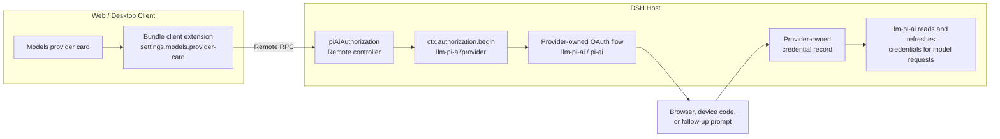

# dsh-bundle-pi-ai-auth

[简体中文](README.zh-CN.md)

Provider-card OAuth controls for DeepSeek Harness pi-ai, with `/auth-*` commands retained as a fallback.

The bundle does not implement provider OAuth protocols or store and refresh tokens itself. `@deepseek-ai/dsh-llm-pi-ai` registers the provider-owned authorization flows and credential records. This bundle adds the generic interaction surfaces around those flows.

## Models settings UI

For every OAuth-capable pi-ai provider, the Models page shows its authorization state and the relevant action:

- **Sign in** starts the provider flow, opens its sign-in URL in the system browser, and displays device codes or follow-up questions in a modal.
- **Sign out** deletes the local provider credential while keeping the provider configured.
- A provider that has not been saved yet shows that OAuth is available, but sign-in remains disabled until the built-in provider form is applied.

The browser extension uses the official `settings.models.provider-card` slot. Its Host RPC controller is also owned by this package, so installing it requires no OAuth-specific edits to the DSH repository.

## State model

OAuth capability, enablement, and login are separate states:

- **OAuth-capable:** the current `llm-pi-ai`/pi-ai installation registered an OAuth flow for the provider.
- **Enabled:** `llm-pi-ai.providers.<provider>` exists, so the provider is a selectable model route.
- **Signed in:** a provider-owned credential exists at `records.llm-pi-ai/<provider>`.

Installing this bundle does not automatically enable any provider. The user first adds a provider in Models settings (or with `/auth-add`), then signs in.

## Fallback commands

- `/auth-list`: list OAuth-capable providers with enablement and login state.
- `/auth-add [provider]`: add and sign in; omitting the provider opens a selection question.
- `/auth-login [provider]`: sign in to an enabled provider.
- `/auth-status [provider]`: inspect one provider; without a provider it behaves like `/auth-list`.
- `/auth-logout [provider]`: remove the local credential while keeping the provider enabled.
- `/auth-remove [provider]`: remove a user-added provider and its local credential.

A provider enabled by another bundle's base configuration cannot be removed with `/auth-remove`; update the owning bundle instead.

## Requirements

- DeepSeek Harness `0.1.6-alpha.1` or a compatible later `0.1.x` release that provides `settings.models.provider-card`
- A Web/Desktop composition containing `authorization`, `credentials`, `settings`, `llm-pi-ai`, the Remote gateway, and the Models settings UI
- An account entitled to use the selected provider

OAuth itself works with the upstream `0.1.6-alpha.2` UI. That release can still
show the generic API-key editor for an OAuth-only provider because it does not
yet expose the adapter's `apiKeyConfigurable` capability. A DSH build carrying
that generic capability hides the inapplicable API-key/Edit controls. This
bundle deliberately does not patch or hide core UI with provider-specific CSS.

## Install

Install the current GitHub version into a Web profile:

```sh
dsh plugin --profile web add github:dingyiliao/dsh-bundle-pi-ai-auth
```

The same package spec can be entered in Desktop's plugin manager. Restart the
corresponding DSH app after installation, add an OAuth-capable provider under
**Settings → Models**, and use the sign-in action on that provider card.

## Architecture



No temporary token environment variable is created. Logout removes the local record; it does not claim to revoke the grant at the remote provider.

## License

MIT
