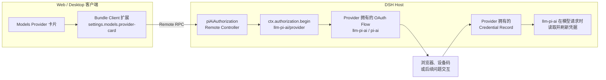

# dsh-bundle-pi-ai-auth

[English](README.md)

在 DeepSeek Harness 的 pi-ai Provider 卡片中提供 OAuth 登录/退出操作，同时保留 `/auth-*` 命令作为兜底。

本 Bundle 不实现 Provider 的 OAuth 协议，也不自行保存或刷新 token。`@deepseek-ai/dsh-llm-pi-ai` 负责注册 Provider 自己的授权 flow 和 credential record；本 Bundle 只在这些 flow 外提供通用交互界面。

## Models 设置界面

对于每个支持 OAuth 的 pi-ai Provider，Models 页面会直接显示授权状态和对应操作：

- **登录**：启动 Provider 的授权 flow，使用系统浏览器打开登录地址，并在弹窗中承载设备码或后续问题。
- **退出登录**：删除本地 Provider 凭据，但保留 Provider 配置。
- 尚未保存的 Provider 会提示可以使用 OAuth，但只有先应用内置 Provider 表单后才能登录。

浏览器扩展使用 DSH 官方的 `settings.models.provider-card` 插槽；Host RPC Controller 也由本包自己提供。因此安装它不需要给 DSH 仓库增加 OAuth 专用源码。

## 状态模型

“支持 OAuth”“已启用”和“已登录”是三个不同状态：

- **支持 OAuth**：当前 `llm-pi-ai`/pi-ai 已为该 Provider 注册 OAuth flow。
- **已启用**：`llm-pi-ai.providers.<provider>` 存在，该 Provider 是可选择的模型路由。
- **已登录**：`records.llm-pi-ai/<provider>` 中存在 Provider 自己写入的凭据。

安装 Bundle 不会自动启用 Provider。用户先在 Models 设置中添加 Provider（或者运行 `/auth-add`），再完成登录。

## 兜底命令

- `/auth-list`：列出支持 OAuth 的 Provider 及启用、登录状态。
- `/auth-add [provider]`：添加 Provider 并登录；省略 Provider 时显示选择问题。
- `/auth-login [provider]`：登录一个已经启用的 Provider。
- `/auth-status [provider]`：查看单个 Provider；省略时等同 `/auth-list`。
- `/auth-logout [provider]`：删除本地凭据，但保留 Provider 配置。
- `/auth-remove [provider]`：删除用户添加的 Provider 配置及其本地凭据。

由其他 Bundle 的基础配置启用的 Provider 不能通过 `/auth-remove` 删除，应当修改拥有该配置的 Bundle。

## 要求

- DeepSeek Harness `0.1.7-rc.2`（本版兼容性基线），或从 `0.1.7` 开始的兼容 `0.1.x` 稳定版
- Web/Desktop 组装包含 `authorization`、`credentials`、`settings`、`llm-pi-ai`、Remote Gateway 和 Models 设置界面
- 对应账号具有该 Provider 所要求的访问权限

核心 Models UI 仍可能为 OAuth-only Provider 显示通用 API Key 编辑表单。暴露适配器
`apiKeyConfigurable` 能力的 DSH 构建会隐藏不适用的 API Key/Edit 控件；本 Bundle 不会通过 Provider 专用 CSS
去修改或遮挡核心 UI。

## 安装

将当前 GitHub 版本安装到 Web Profile：

```sh
dsh plugin --profile web add github:dingyiliao/dsh-bundle-pi-ai-auth
```

Desktop 的插件管理器也可以直接填写同一个包地址。安装后重启对应的 DSH
应用，在 **设置 → Models** 中添加支持 OAuth 的 Provider，然后使用该卡片上的登录按钮。

## 架构



本实现不会创建临时 token 环境变量。退出登录只删除本地 record，并不声称已经在远端 Provider 撤销授权。

## 许可证

MIT
